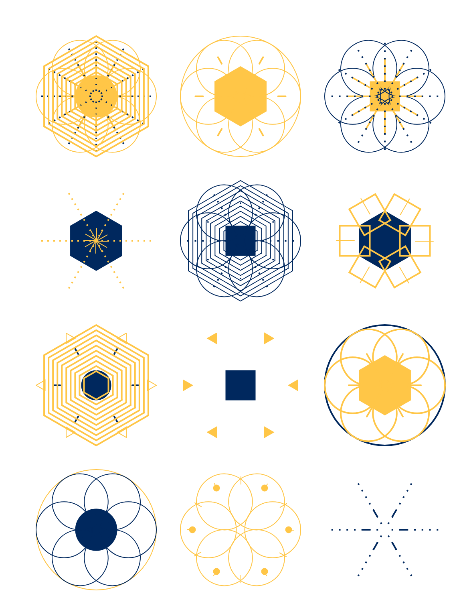

# Generative Crystals

This is the result of me working through Matthew Epler’s YouTube series [Designing Generative Systems](https://www.youtube.com/watch?v=rTqvf0BkTNE&list=PLyRZnpOSgMj3K8AV2I6UldnvTj6d_Zrf0). You can find his code [here](https://github.com/matthewepler/Generative-Design-Systems-with-P5js) and some of the details of what I changed and learned [here](https://stephanmax.is/writing/generative-art-with-p5js).

In 2018, this project was featured in Glitch’s showcase [Looky What We Made](https://blog.glitch.com/post/looky-what-we-made).

